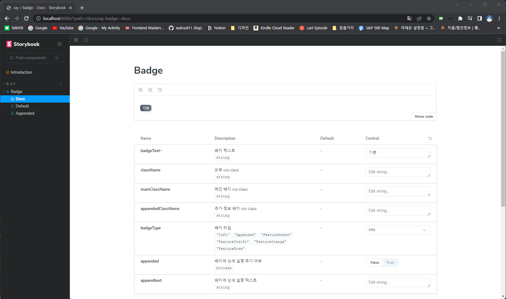

# shared-component-lib

[react](https://react.dev/) + [tailwindcss](https://tailwindcss.com/) + [storybook](https://storybook.js.org/) 컴포넌트 라이브러리 보일러 플레이트 코드.

## 1. 초기화

[degit](https://github.com/Rich-Harris/degit)

```bash
$ degit https://github.com/walrus811/shared-component-lib my-lib # 원하는 폴더 이름
$ pnpm i
$ pnpm run storybook # storybook 실행
```



## 2. 다른 프로젝트에서 사용하기

**현재 프로젝트**

```bash
$ pwd
c/Users/walru/Desktop/react/shared-component-lib
$ pnpm run build
$ pnpm run link
```

**사용할 프로젝트**

| 사용할 프로젝트도 tailwindcss를 사용해야함!

```bash
$ pwd # 예시(nextjs)
/c/Users/walru/Desktop/react/my-app
$ pnpm link shared-component-lib --global
```

_tailwind.config.js_

아래처럼 `./node_modules/shared-component-lib/dist/**/*.{js,ts,jsx,tsx,mdx}` 컴포넌트 라이브러리도 포함시켜서 트리 쉐이킹 동작을 막아야함. 안 그러면 해당 프로젝트에서 사용 안 되는 tailwindcss 클래스가 컴파일이 안 됨.

```js
/** @type {import('tailwindcss').Config} */
module.exports = {
  content: [
    "./pages/**/*.{js,ts,jsx,tsx,mdx}",
    "./components/**/*.{js,ts,jsx,tsx,mdx}",
    "./app/**/*.{js,ts,jsx,tsx,mdx}",
    "./node_modules/shared-component-lib/dist/**/*.{js,ts,jsx,tsx,mdx}",
  ],
  theme: {
    extend: {
      backgroundImage: {
        "gradient-radial": "radial-gradient(var(--tw-gradient-stops))",
        "gradient-conic":
          "conic-gradient(from 180deg at 50% 50%, var(--tw-gradient-stops))",
      },
    },
  },
};
```

_index.tsx_

이제 그냥 쓰면 됨 ㅋ

```tsx
import { Badge, BadgeType } from "shared-component-lib";

export default function Home() {
  return (
    <main className={`flex min-h-screen items-center justify-between p-24 `}>
      <Badge
        badgeText="바보"
        badgeType={BadgeType.FeatureGreen}
        appended={true}
        appendtext="멍청이"
        mainClassName="text-2xl animate-spin"
        appendedClassName="text-3xl animate-bounce"
      />
    </main>
  );
}
```
